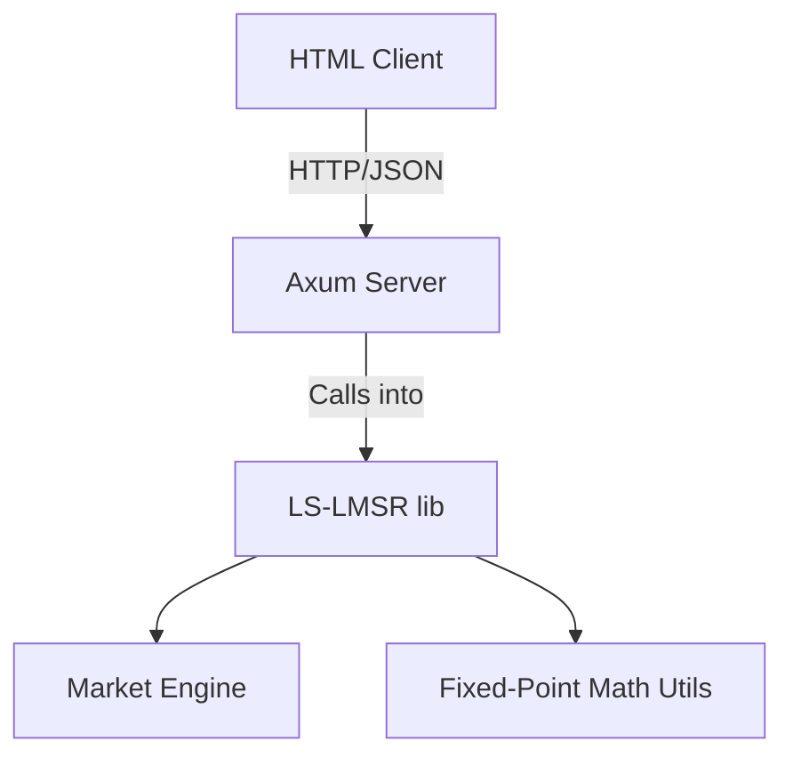
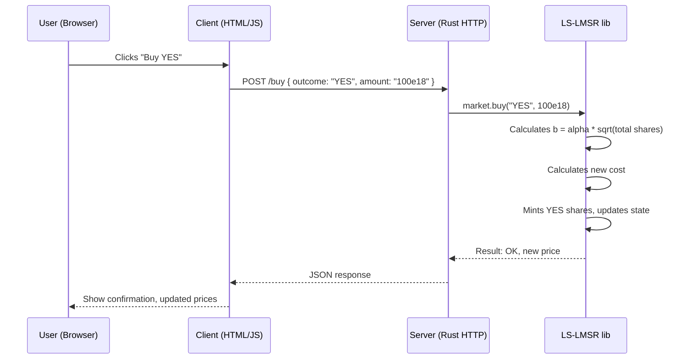

# LS-LMSR Prediction Market – Design Document

* I am not a maths I am a code. I make no claims to validity of the math with in.

## Overview

This prediction market uses the Liquidity-Sensitive Logarithmic Market Scoring Rule (LS-LMSR) to price YES/NO outcome shares. The system is structured in three layers:

- **lib**: Pure Rust library implementing LS-LMSR math and engine
- **server**: HTTP interface exposing market actions (buy, sell, price, simulate)
- **client**: HTML/JS interface for interacting with the server

---

## Architecture



---

## Module Breakdown

### `lib`

- `lslmsr.rs`: Implements cost/pricing logic
- `market.rs`: Market state and trade logic
- `types.rs`: Share structs, enums, errors
- Uses `u128` fixed-point math (1e18 scale)

### `server`

- Built with `axum` or `actix-web`
- Routes:
  - `GET /price`
  - `GET /depth`
  - `POST /buy`
  - `POST /sell`
  - `POST /simulate`

- Wraps a `MarketEngine` in a shared `Arc<Mutex<...>>`

### `client`

- HTML/JS frontend
- Fetches data, renders prices, allows trade submission

---

## Sequence Diagram – Buying Shares



---

## Trade Cost Math (Fixed-Point)

```text
b = alpha * sqrt(q_yes + q_no)

C(q) = b * ln(e^(q_yes/b) + e^(q_no/b))
Price(YES) = e^(q_yes/b) / (e^(q_yes/b) + e^(q_no/b))
```

Values handled in `u128` with 18 decimals (fixed-point math).

---

## Example API Schema

### POST /buy
```json
{
  "outcome": "YES",
  "amount": "100000000000000000000"
}
```

### Response
```json
{
  "success": true,
  "new_price": {
    "yes": "0.540000000000000000",
    "no": "0.460000000000000000"
  }
}
```

---

## Future Improvements

- Multi-outcome support
- Fee mechanisms
- Persistent storage backend (Postgres or file)
- Authentication for user wallets

---
